

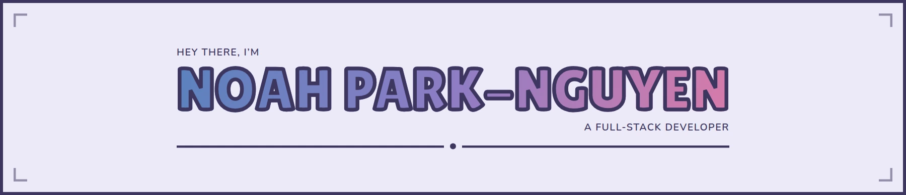

 

Thanks for stopping by! My name is Noah, I'm a full-stack developer, computer
science grad, and professional nap taker living in Ottawa, Ontario. I mainly do
web development and frontend stuff for fun, while my professional experience has
mostly been in the backend and internal tools.

 
 

<a href="https://github.com/noahparknguyen/statmon">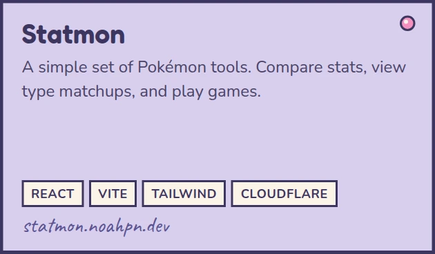</a>
<a href="https://github.com/noahparknguyen/hubspot-recommendation-tool">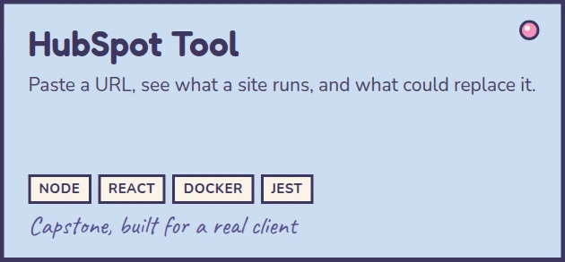</a>
<a href="https://github.com/noahparknguyen/portfolio">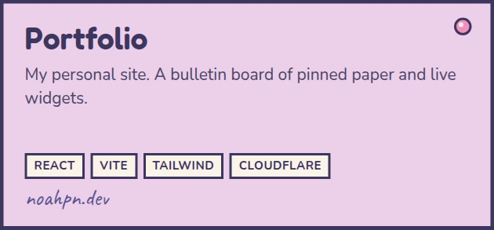</a>

 

<a href="https://react.dev">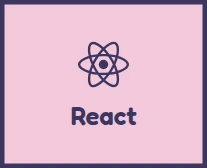</a>
<a href="https://tailwindcss.com">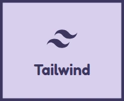</a>
<a href="https://www.java.com">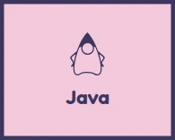</a>
<a href="https://www.python.org">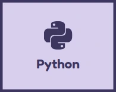</a>
<a href="https://www.figma.com">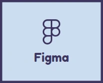</a>
<a href="https://obsidian.md">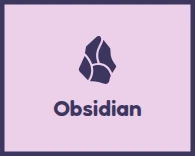</a>
<a href="https://spring.io">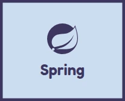</a>

 

